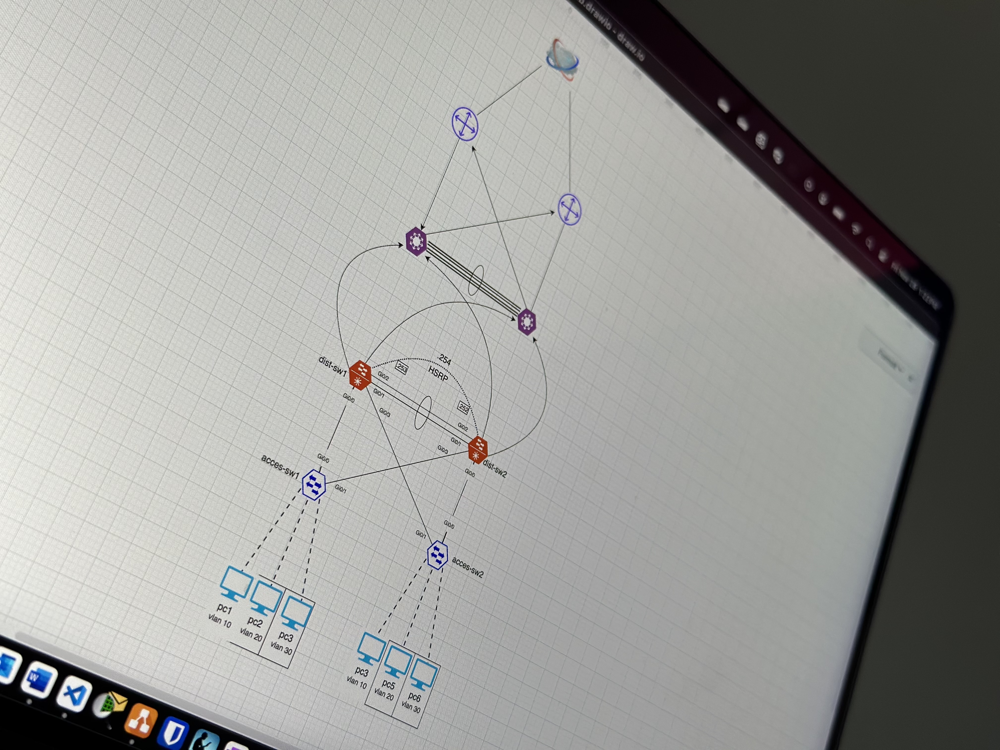

# Welcome to my portfolio

## About me

I am Baltej Giri. I am a Computer Networking Professional with six plus years of experience in Information Technology. I am passonate about creating network designs, write technical articles, and master networking protocols. I am a lifelong learner and like to stay connected with like minded people.

## Skills

- Computer Networking
- Cloud Networking
- Web Development
- Problem-solving
- Technical Documentation

## Roadmap

I am planned to learn Github, Technical Writing, Network Administration tools: Switching, Routing, and Programming language. The ultimate long term goal is to master each of these topics.

### Short-term goals
Being proficent in following skills and tools.
- Github
- Technical Documentation
- Network Administrator
- Network Design

### Mid-term goals

The plan is to have a good understanding of **Python**. Python is a versatile programming language. The network automation is done using Python, it helps to automate repetative tasks like: Deploying multiple switches, updating policies and much more.

### Long-term goals
The short and mid-term goals are the objectives of long-term goals. The long-term goals are projected to be completed in 2-3 year of time frame. An additional aspect of working in Networking field is to adept with new technologies. ChatGPT is an perfect example of it. There will be some times when i will have to make learn some additional skills based of the requirements of my professional career. The ultimate goal is to stay focused and continue learn.

- Mastering network protocols
- Network design
- Python as programming language

## Certifications
IT certifications are great way to prove the skills that an indvidual has in the field. However, getting an IT certification itself does not help. An IT certification can help to get a job interview or fullfil a requirement on on a job description but what matters on the actual job is experience and deep understanding of protocols. 

IT certs can be used to learn the skills, they have a good curiculum to follow but while pursuing a certification, many focus on just getting a certfication by all means and often it becomes a chasing game. 

Instead soley focusing on getting a certification, in my optinion it is better to use the certification curiculum and master the each concepts. Understand the fundamentals of protocols and technologies. It is important to take time and have a understanding of skills tested in the cert which will pay-off twice, first to excel at job and second to obtain a offical cert. 

I am going to work towards Cisco's Professional Certification for Enterprise Networking. It's is often referred as CCNP then specilises in Enterprise Networking.

## How to reach me?
I am available on LinkedIn, X (previously Twitter) and I write blogpost on my website.

[LinkedIn](https://www.linkedin.com/in/baltej-giri)

[X](https://x.com/giribaltej)

[Blogpost](https://baltejgiri.github.io)
<!---
baltejgiri/baltejgiri is a ✨ special ✨ repository because its `README.md` (this file) appears on your GitHub pro.file.
You can click the Preview link to take a look at your changes.
--->
